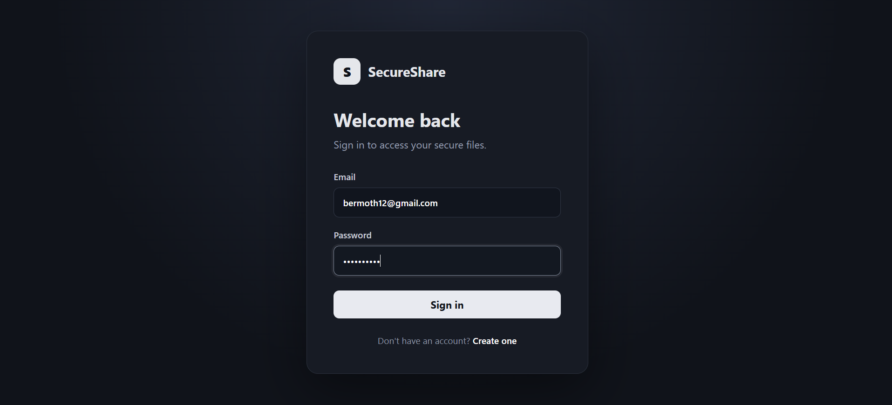
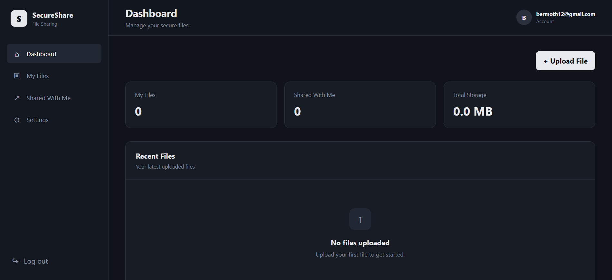
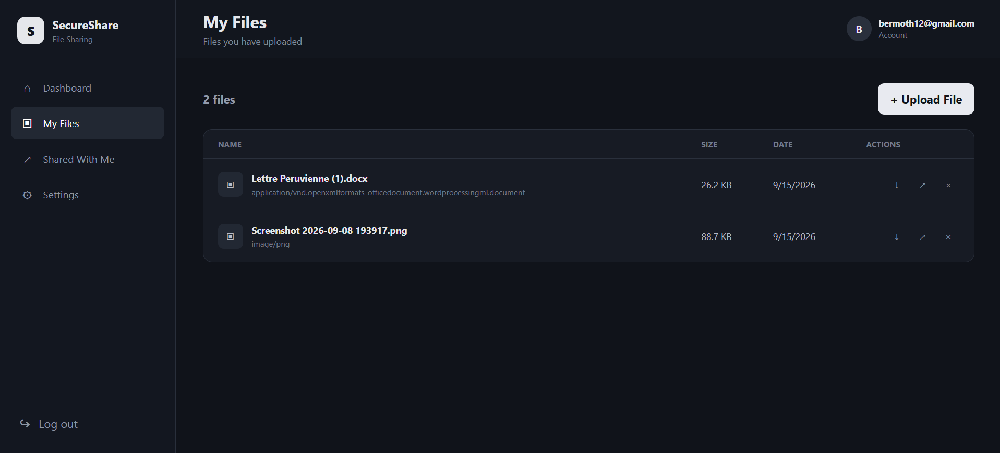
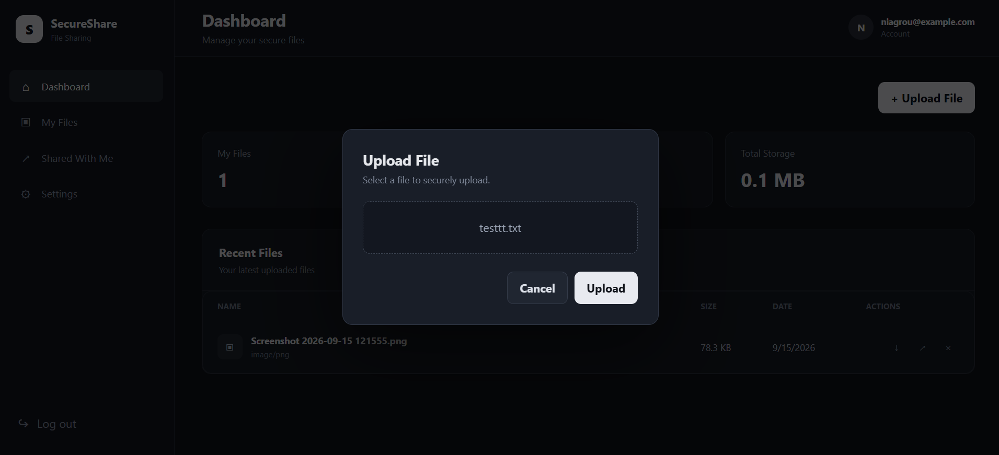
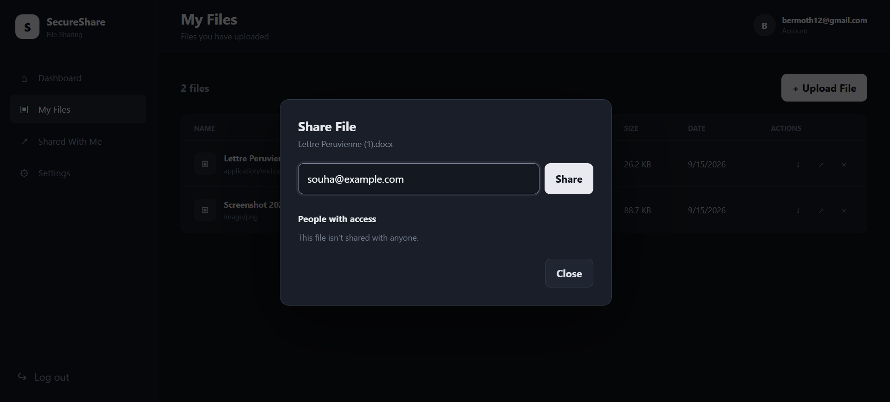
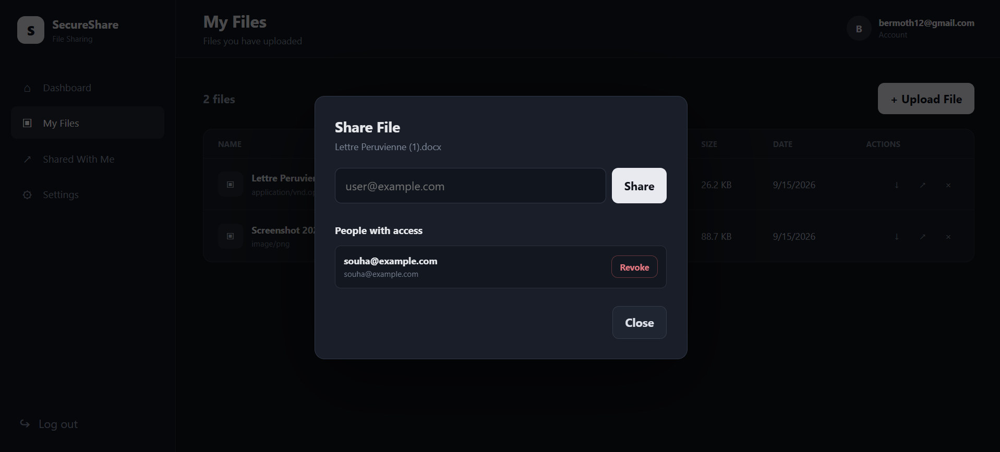
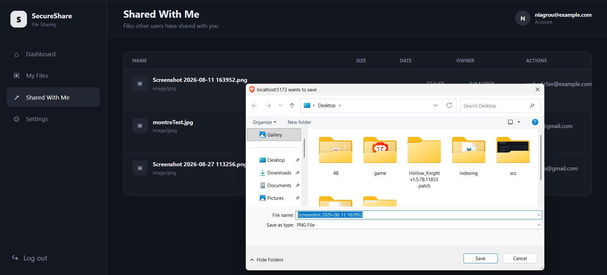
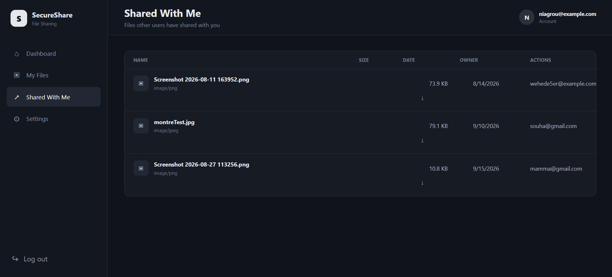
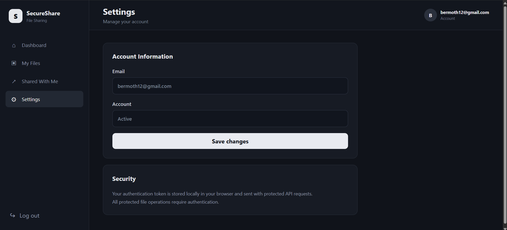

# Secure File Sharing Platform

A web application for uploading, managing and sharing files between users.

I built this project to practice backend development with Spring Boot and to learn how a React frontend can communicate with a REST API.

## Screenshots

### Login




### Dashboard



### My Files



### Actions On Files









### Shared Files



### Settings



## Features

* Create an account and log in
* JWT authentication
* Upload files
* View uploaded files
* Download files
* Delete files
* Share files with other users by email
* See who has access to a file
* Revoke access to a shared file
* View files shared with you
* Protected file access based on ownership and sharing permissions

## Technologies

### Backend

* Java 21
* Spring Boot
* Spring Security
* JWT
* Spring Data JPA / Hibernate
* PostgreSQL
* Maven
* AES-256-GCM

### Frontend

* React
* Vite
* React Router
* JavaScript
* CSS

### Other

* Docker
* Docker Compose

## Project Structure

```text
secure-file-sharing-platform/
│
├── backend/
│   └── secure-file-sharing-platform/
│       ├── src/
│       ├── Dockerfile
│       └── pom.xml
│
├── frontend/
│   ├── src/
│   │   ├── components/
│   │   ├── pages/
│   │   ├── services/
│   │   ├── App.jsx
│   │   └── index.css
│   └── package.json
│
├── docs/
│   └── screenshots/
│
├── docker-compose.yml
├── .env
└── README.md
```

## Running the project

### 1. Start the backend

Open a terminal in the project folder and run:

```bash
cd backend/secure-file-sharing-platform
mvn clean package -DskipTests
cd ../..
docker compose up --build
```

The backend runs on:

```text
http://localhost:8080
```

### 2. Start the frontend

Open another terminal:

```bash
cd frontend
npm install
npm run dev
```

The frontend runs on:

```text
http://localhost:5173
```

### 3. Database

PostgreSQL is started with Docker Compose together with the backend.

The database configuration is stored in environment variables rather than directly in the source code.

## Environment Variables

Create a `.env` file in the project root:

```env
POSTGRES_PASSWORD=your_database_password
JWT_SECRET=your_jwt_secret
FILE_ENCRYPTION_KEY=your_base64_encoded_32_byte_key
```
The FILE_ENCRYPTION_KEY is a Base64-encoded 32-byte key used for AES-256-GCM file encryption.

## API

| Method | Endpoint                     | Description               |
| ------ | ---------------------------- | ------------------------- |
| POST   | `/auth/login`                | Log in                    |
| POST   | `/users`                     | Create an account         |
| GET    | `/files/myFiles`             | Get your files            |
| GET    | `/files/shared`              | Get files shared with you |
| POST   | `/files/upload`              | Upload a file             |
| GET    | `/files/{id}/download`       | Download a file           |
| DELETE | `/files/{id}`                | Delete a file             |
| POST   | `/files/{id}/share`          | Share a file              |
| GET    | `/files/{id}/shares`         | Get users who have access |
| DELETE | `/files/{id}/share/{userId}` | Revoke access             |

## Authentication and Security

The application uses JWT for authentication.

After logging in, the backend returns a JWT token. The frontend stores the token and sends it with requests to protected endpoints.

Spring Security checks the token before allowing access to protected resources.

Passwords are hashed before being stored in the database.

Files can only be downloaded by their owner or by users who have been given access to them.

Only the owner of a file can delete it, share it or revoke access.

Sensitive configuration such as the database password and JWT secret is stored in environment variables.


## File Encryption

Uploaded files are encrypted before being stored on the server using AES-256-GCM.

Each encrypted file has its own randomly generated initialization vector (IV), which is stored with the encrypted data. The encryption key is kept separately in an environment variable.

The database stores file metadata such as the original filename, size and storage path. The actual file contents are stored in the Docker file-storage volume in encrypted form.

When an authorized user downloads a file, the backend decrypts it and returns the original file to the user.

Sensitive configuration such as the database password, JWT secret and file encryption key is stored in environment variables.

## Docker

The project uses Docker Compose to run the backend and PostgreSQL database.

The main services are:

```text
filesharing-app
filesharing-postgres
```

The backend is built from the Spring Boot application and PostgreSQL uses the official PostgreSQL image.

## Possible Improvements

Some things that could be added in the future:

* File size and type restrictions
* Password reset
* Email notifications
* File previews
* Expiring share links
* Audit logs
* Production deployment
